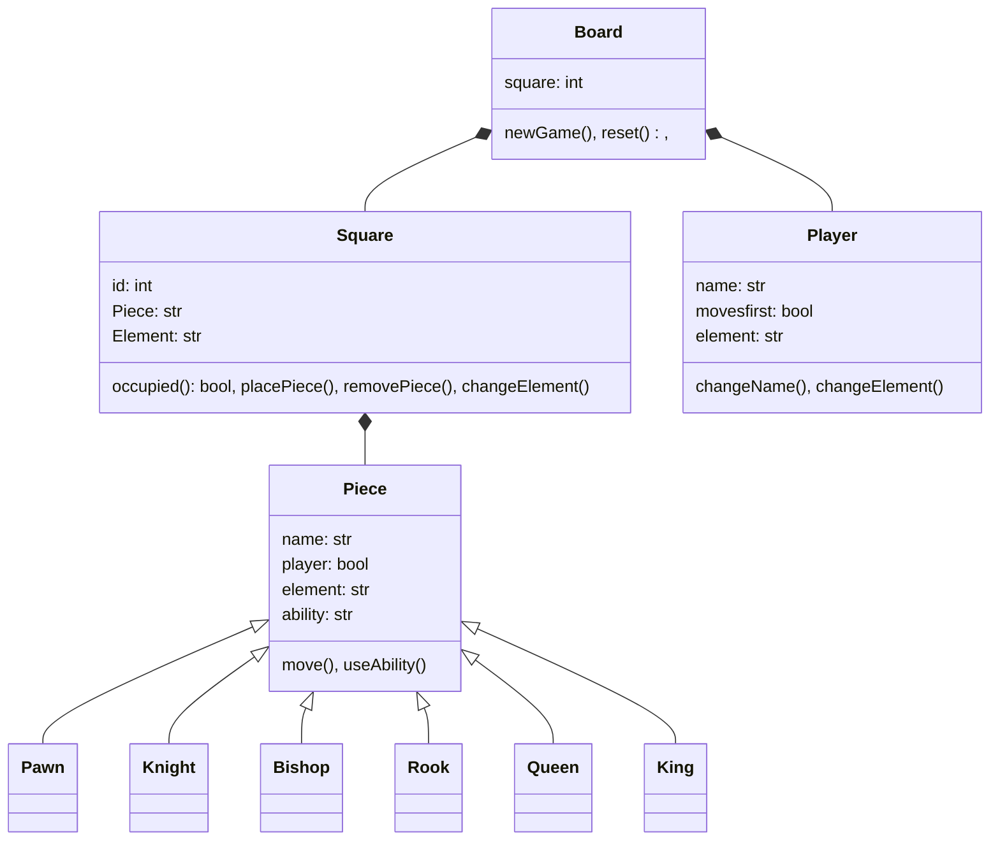

# Elemental Chess
1) Project Name: Elemental Chess

   Team Name: Team Elements

   Team Member(s): Vijay Kodali

   I am trying to build a turn-based strategy game inspired by chess where the player can choose an element which gives pieces unique abilities. It will be a fun    new game for strategy gamers to enjoy. I want to build this project to challenge myself to learn some elements of game design while also practicing all of the    fundamentals of object-oriented programming and graphical representation.

2)

3) Team Member: Vijay Kodali

   Game Design: 10 hours

   Board Representation w/ Static Pieces: 2 hours

   Player Names and Choosing an Element: 2 hours

   Piece Movement: 5 hours

   Piece Abilities: 10 hours

   New Game Functionality: 2 hours

   Since I am doing this project alone, all work will be done by me. The main problem area I can see is piece abilities. Depending on the complexity of the interactions, this could take a lot of time since abilities could interact with different elements in unique ways. I will need to be mindful of the scope when designing the abilities. Additionally, piece movement could take longer than anticipated since the user needs to have an indication of all legal moves when clicking a piece. Also, game design may be difficult to accurately estimate since it will not all take place at the beginning. Initial game design may have to be changed periodically as complications arise during development or gameplay testing.
